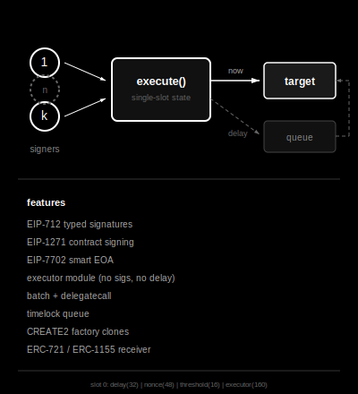
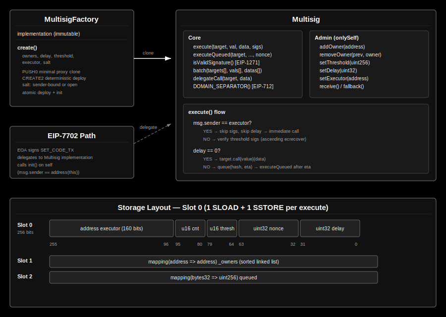

# Multisig

Minimal k-of-n multisig wallet with optional timelock, executor module, batched execution, and delegatecall. Two deployment paths: factory clones and EIP-7702 EOA delegation. All mutable state (`delay`, `nonce`, `threshold`, `executor`) is packed into a single storage slot.





## Usage

```bash
forge build
forge test
```

## Factory Deployment

Deploy a standalone multisig via `MultisigFactory`:

1. `MultisigFactory.create(owners, delay, threshold, executor, salt)` — deploys a deterministic PUSH0 minimal proxy clone and calls `init`.
2. Owners sign EIP-712 `Execute` messages off-chain.
3. Anyone relays `execute(target, value, data, sigs)` with signatures sorted by signer address (ascending).

When `delay` is set, transactions are queued with an ETA and executed later via `executeQueued`. Use `batch` and `delegateCall` through `execute(address(this), ...)` to atomically bundle calls or run arbitrary code in the wallet's context.

## EIP-7702 Deployment

Turn an existing EOA into a multisig-enhanced account:

1. Submit a `SET_CODE_TX` that delegates to the Multisig implementation and calls `init(owners, delay, threshold, executor)` in the same transaction.
2. The EOA now supports `execute`, `batch`, and ERC-1271 `isValidSignature`.
3. Manage configuration atomically via `batch`: `addOwner`, `removeOwner`, `setThreshold`, `setDelay`, `setExecutor`.

The EOA private key remains a superuser — it can send regular transactions and revoke the delegation at any time. Suited for personal wallets where the key holder wants co-signing, not shared custody.

## Executor

An optional `executor` address bypasses both signature verification and timelock delay, enabling two patterns:

**Security Council** — A protocol's admin is a timelocked multisig (e.g. 3-of-5, 2-day delay). The executor is a separate security council (e.g. 5-of-9). During an active exploit, the council calls `execute` directly — no owner signatures, no delay. Owners revoke via `setExecutor(address(0))`.

**Social Recovery** — The executor is a guardian multisig (trusted contacts). If the owner loses their keys, guardians call `execute` to rotate owners via `addOwner`/`removeOwner`/`setThreshold`.

The executor has full control by design. The timelock gives stakeholders an exit window against the *owners* — the executor operates outside it. If the executor is compromised, owners revoke it through the normal timelocked path.

## Comparison with Safe

| Feature | This Multisig | Safe |
|---|---|---|
| **Core LOC** | 254 (single file) | ~3,500 (multiple files) |
| **Runtime bytecode** | ~8.4 KB | ~23 KB |
| **Proxy clone size** | 45 bytes (PUSH0) | 45 bytes (EIP-1167) |
| **Storage: core state** | 1 slot (packed) | Multiple slots |
| **SLOAD/SSTORE for state** | 1 / 1 | Multiple |
| **Timelock** | Built-in (`delay`) | Modular (Zodiac Delay) |
| **Executor role** | Built-in | Modular (`execTransactionFromModule`) |
| **Batch execution** | Built-in (`batch`) | Composable (MultiSend) |
| **Delegate call** | Built-in (`delegateCall`) | Built-in (operation enum) |
| **EIP-712 / EIP-1271** | Built-in | Built-in |
| **Signature types** | ECDSA only | ECDSA, EIP-1271, pre-approved hashes |
| **EIP-7702** | Native (dual-path init) | SafeEIP7702Proxy |
| **Module system** | Single-slot (`executor`) | Multi-module (linked list) |
| **Guard system** | No | Yes (pre/post transaction hooks) |
| **CREATE2 factory** | Yes (sender-bound salt) | Yes |

### Gas Benchmarks

This multisig: `forge test --mc GasTest -vv` (`gasleft()` snapshots, warm storage). Safe: `npm run benchmark` in [safe-smart-account](https://github.com/safe-global/safe-smart-account).

| Operation | This Multisig | Safe | Delta |
|---|---|---|---|
| **Deploy (proxy + init)** | | | |
| 1 owner | — | 166,375 | — |
| 2 owners | — | 189,886 | — |
| 3 owners | 254,312 | 213,385 | +19% |
| **ETH transfer** | | | |
| 1-of-1 | 43,377 | 58,142 | -25% |
| 2-of-2 | — | 65,193 | — |
| 2-of-3 | 47,564 | — | — |
| 3-of-3 | 51,751 | 72,293 | -28% |
| 3-of-5 | — | 72,281 | — |
| **Executor (no sigs)** | 40,851 | — | — |
| **Queue (delay)** | 35,545 | — | — |
| **Execute queued** | 38,631 | — | — |
| **Batch 3 ETH transfers** | 65,469 | — | — |

- Execution is 25-28% cheaper due to single-slot state packing. Each additional signer adds ~4,200 gas (`ecrecover` + `isOwner` SLOAD).
- Executor, timelock, and batch are built-in. Safe requires external modules and MultiSend.
- Deployment is 19% more expensive — dual storage writes per owner (`owners[]` + `isOwner` mapping) for O(1) runtime lookups. One-time cost, recovered in ~10 executions.
- Safe's overhead pays for guard hooks, gas refunds, multiple signature types, and fallback handler dispatch.

Safe composes features as separate contracts (modules, guards, fallback handlers). This multisig ships them as built-in primitives in a single file with all hot-path state in one slot. The single-slot executor lends itself to a singleton or registry pattern — point it at a router contract to dispatch across multiple sub-modules without per-wallet storage overhead.

## License

MIT
